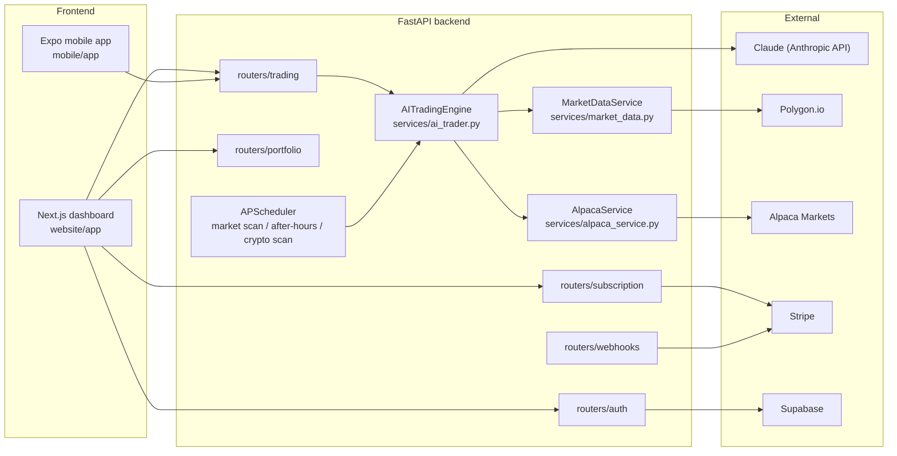

# GreenGeniusAI

**An AI-powered automated trading platform** — a Claude-driven trading engine analyzes stocks
and crypto around the clock, explains every decision in plain English, and can execute trades
through a real brokerage (Alpaca), all wrapped in a Next.js dashboard with a $8.99/mo Stripe
subscription and an early-stage mobile app.

## What it is

Three pieces in one repo:

- **`backend/`** — a FastAPI service. Its core is `services/ai_trader.py`, an `AITradingEngine`
  that prompts Claude with live market data, technical indicators, and portfolio context, and
  gets back a structured trade decision (action, size, stop-loss, and a plain-English
  explanation). `services/alpaca_service.py` executes trades through Alpaca's brokerage API;
  `services/market_data.py` pulls live quotes and computes indicators (RSI, MACD, Bollinger
  Bands, ATR, …) from Polygon.io. APScheduler runs the engine on a real cadence — see the
  scheduled jobs table below.
- **`website/`** — the Next.js 14 dashboard: onboarding, checkout, a trading dashboard (bots,
  watchlist, risk, news, derivatives, perpetuals, IPOs, alerts), and a Supabase-backed auth
  layer. Currently gated behind a private access code rather than open subscription signup
  (see `app/access`).
- **`mobile/`** — an Expo / React Native app skeleton (tab navigation scaffolded, screens not
  yet built out).

This is a working prototype, not an audited production trading system — read `LAUNCH_GUIDE.md`
for the operator's own checklist of what's still needed (legal/compliance, real payment go-live,
etc.) before it could take real customer money.

## Features

- **AI trade analysis** — `POST /trading/analyze` runs a full Claude-driven analysis on any
  ticker and returns a structured decision with reasoning.
- **Autonomous scheduling** — a market scan every 20 minutes during market hours, an
  after-hours deep analysis, and a crypto scan every 30 minutes, all via APScheduler.
- **Broker execution** — real Alpaca paper/live trading integration (`ALPACA_PAPER` toggles
  between them).
- **Subscription billing** — Stripe checkout, billing portal, and webhook handling.
- **Live dashboard** — positions, orders, P&L, risk, and a rotating multi-thousand-ticker news
  scanner, all reading from a live Alpaca account.

## Tech stack

| Layer | Choice |
|---|---|
| Backend | FastAPI, APScheduler, `alpaca-py`, `anthropic`, Polygon.io via `httpx`, `pandas` + `ta` for indicators |
| AI | Claude (Anthropic API) — the trading engine's entire decision layer |
| Frontend | Next.js 14 (App Router), React 18, Tailwind CSS, Zustand, `lightweight-charts` / Recharts |
| Auth & DB | Supabase |
| Payments | Stripe |
| Mobile | Expo / React Native (early scaffold) |

## Quickstart

Backend:

```bash
cd backend
pip install -r requirements.txt
cp ../.env.example .env   # fill in ANTHROPIC_API_KEY, POLYGON_API_KEY, ALPACA_*, etc.
uvicorn main:app --reload --port 8000
```

Website:

```bash
cd website
npm install
cp ../.env.example .env.local
npm run dev   # http://localhost:3000
```

Mobile (Expo):

```bash
cd mobile
npm install
npm start
```

See `LAUNCH_GUIDE.md` for the full account/API-key setup checklist (Anthropic, Polygon,
Alpaca, Stripe, Supabase) and `.env.example` for every variable the app reads.

## Architecture



## Project structure

```
backend/
  main.py                  FastAPI app, CORS, APScheduler jobs
  routers/                 auth, portfolio, trading, subscription, webhooks
  services/
    ai_trader.py            Claude-driven trading decisions
    market_data.py           Polygon.io quotes + technical indicators
    alpaca_service.py        broker execution (paper/live)
    stripe_service.py        subscription billing
  models/trade.py           trade decision / action / asset-class types
website/
  app/                      marketing, onboarding, checkout, dashboard/*
  lib/                      alpaca client, auto-trade, signal engine, security, sessions
mobile/
  app/(tabs)/               Expo Router tab scaffold
mcp-server/                 MCP server exposing this repo to AI assistants (see below)
LAUNCH_GUIDE.md             operator checklist: accounts, compliance, go-live steps
```

## MCP Server

`mcp-server/` is a working [Model Context Protocol](https://modelcontextprotocol.io) stdio
server that reads this repository directly — no hardcoded data — so an AI assistant can
introspect the real backend, scheduler, and dashboard instead of guessing at them.

| Tool | What it does |
|---|---|
| `get_api_routes` | Every FastAPI endpoint parsed from `backend/routers/*.py` |
| `get_scheduler_jobs` | Every APScheduler job in `backend/main.py`, with its real cron/interval schedule |
| `get_dashboard_pages` | Every page route under `website/app/` |
| `get_env_reference` | Every variable in `.env.example`, grouped by section |
| `search_code` | Regex search across all tracked source files |
| `read_file` | Read any file in the repo by relative path |

```bash
cd mcp-server
npm install
claude mcp add greengeniusai -- node mcp-server/server.mjs
```

See `mcp-server/README.md` for details.

## License

MIT — see [LICENSE](./LICENSE).
